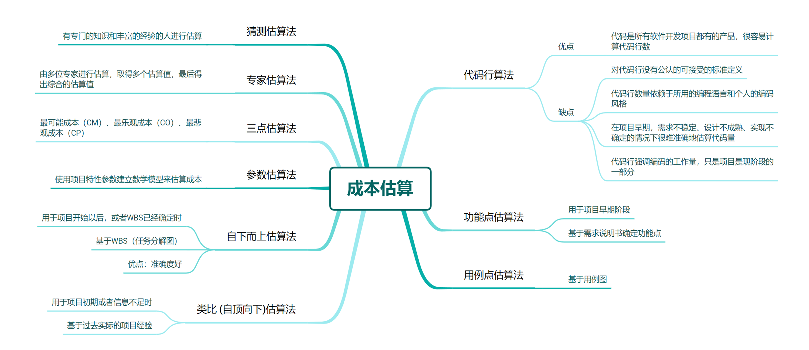

# 软件项目管理——成本计划

## 成本估算方法

### 功能点估算法

1）确定应用程序必须包含的功能

2）对于每个功能，通过4类外部行为或者事务的数目，以及一类内部逻辑文件的数目来估算由一组需求所表达的功能点数目

这五类功能计数项分别是：

- **外部输入EI**：外部输入给软件提供面向应用的数据项，如登陆信息输入、日记输入等
- **外部输出EO**：向用户提供(经过处理的)面向应用的信息，如聊愈的输出、活动参加状态等
- **外部查询EQ**：一个输入引出一个即时的简单输出，如活动查询、日记查询等
- **内部逻辑文件ILF**：数据完全存在于应用的外部，并且由另一个应用维护，如用户信息表、活动表等
- **外部接口文件EIF**：如微信登录接口，大模型接口等

3）对五类功能计数项中的每一类按照其复杂度不同分为简单、一般和复杂。所有功能计数项加权的总和，就形成了该产品的未调整功能点计数（UFC）。

4）计算项目中14个技术复杂度因子（TCF） 

技术复杂度因子TCF计算公式如下：

$$
TCF=0.65+0.01*\sum{F_i}=1.06
$$

5）调整所计算的功能点（FP）

$$
FP =
UFC * TCF  =
210 * 1.06 = 222.6
$$

FP: 功能点

UFC: 未调整功能点计数

TCF: 技术复杂度因子

6）计算总成本

假设：项目的生产率PE=0.1人月/功能点，每人月的成本为1万元

则项目的规模 = 222.6* 0.1 = 22.26人月

总成本 = 22.26人月 * 1万元/人月 = 22.26万元

### 自下而上估算法

利用任务分解图(WBS),对各个具体工作包进行详细的成本估算,然后将结果累加起来得出项目总成本。

通常是在项目开始以后，或者WBS已经确定的项目，需要进行准确估算的时候釆用。

**系统实现的详细内容如下：**

由前置WBS分解总图计算得，项目总工时为419人天 ≈ 14人月；假设每人月的成本为1万元，则：

开发成本 = 14 * 1 = 14万元

管理成本 = 开发成本 * 30% = 14 * 30% = 4.2万元

直接成本 = 开发成本 + 管理成本  = 14 + 4.2 = 18.2 万元

间接成本 = 直接成本 * 20% = 18.2 * 20% = 3.64 万元

总成本 = 直接成本 + 间接成本 = 21.84万元